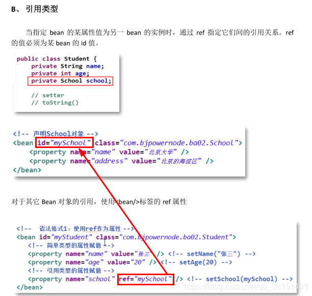

<!-- 
Reference:
https://blog.csdn.net/qq_38151401/article/details/116517865
https://zhuanlan.zhihu.com/p/53084790

 -->

# Spring概述

Spring 的主要作用就是为代码“解耦”，降低代码间的耦合度。就是让对象和对象（模块和模块）之间关系不是使用代码关联，而是通过配置来说明。减轻对项目模块之间的管理， 类和类之间的管理， 帮助开发人员创建对象，管理对象之间的关系。
Spring 根据代码的功能特点，使用 Ioc 降低业务对象之间耦合度。IoC 使得主业务在相互调用过程中，不用再自己维护关系了，即不用再自己创建要使用的对象了。而是由 Spring容器统一管理，自动“注入”,注入即赋值。 而 AOP 使得系统级服务得到了最大复用，且不用再由程序员手工将系统级服务“混杂”到主业务逻辑中了，而是由 Spring 容器统一完成“织入”。

# spring核心功能 ioc控制反转

## 什么是IoC

控制： 创建对象，对象的属性赋值，对象之间的关系管理。

反转： 把原来的开发人员管理，创建对象的权限转移给代码之外的容器实现。 由容器代替开发人员管理对象。创建对象，给属性赋值。

IoC：把对象的创建，赋值，管理工作都交给代码之外的容器实现， 也就是对象的创建是有其它外部资源完成。

## 为什么要用IoC

目的就是减少对代码的改动， 也能实现不同的功能。 实现解耦合。 

## IOC的技术实现——DI依赖注入

Spring 容器是一个超级大工厂，负责创建、管理所有的 Java 对象，这些 Java 对象被称为 Bean。Spring 容器管理着容器中 Bean 之间的依赖关系，Spring 使用“依赖注入”的方式来管理 Bean 之间的依赖关系。使用 IoC 实现对象之间的解耦和。spring是使用的di实现了ioc的功能， spring底层创建对象，使用的是反射机制。

### spring创建对象的步骤

1. 创建maven项目


2. 加入maven的依赖
```java
<dependency>
        <groupId>org.springframework</groupId>
        <artifactId>spring-context</artifactId>
        <version>5.2.5.RELEASE</version>
</dependency>
```
3. 创建类（接口和它的实现类）

4. 创建spring需要使用的配置文件
在 src/main/resources/目录现创建一个 xml 文件，文件名可以随意，但 Spring 建议的名称为 applicationContext.xml。声明类的信息，这些类由spring创建和管理


实例化方式

（一）默认构造 <bean  id="" class=""/>：用于定义一个实例对象。一个实例对应一个 bean 元素。
id：该属性是 Bean 实例的唯一标识，程序通过 id 属性访问 Bean，Bean 与 Bean 间的依赖关系也是通过 id 属性关联的。
class：指定该 Bean 所属的类，注意这里只能是类，不能是接口。

（二）静态工厂<bean id="" class="工厂类" factory-method="静态方法">

静态工厂：用于生成实例对象，所有的方法必须是static

```java
public class MyBeanFactory {
    
    public static UserService createService(){
        return new UserServiceImpl();
    }
}
```

```xml
<!-- 将静态工厂创建的实例交予spring 
		class 确定静态工厂全限定类名
		factory-method 确定静态方法名
	-->
	<bean id="userServiceId" class="com.itheima.c_inject.b_static_factory.MyBeanFactory" factory-method="createService"></bean>
```
（三）实例工厂：<bean id="工厂id" class="工厂类">  <bean id="" factory-bean="工厂id" factory-method="方法">

必须先有工厂实例对象，通过实例对象创建对象。提供所有的方法都是“非静态”的。

```xml
<!-- 创建工厂实例 -->
	<bean id="myBeanFactoryId" class="com.itheima.c_inject.c_factory.MyBeanFactory"></bean>
	<!-- 获得userservice 
		* factory-bean 确定工厂实例
		* factory-method 确定普通方法
	-->
	<bean id="userServiceId" factory-bean="myBeanFactoryId" factory-method="createService"></bean>
```

5. 测试spring创建的类

若 Spring 配置文件存放在项目的类路径下，则使用 ClassPathXmlApplicationContext 实现类进行加载。

```text
测试方法规范：

     1）public 方法
     2）没有返回值 void 
     3）方法名称自定义，建议名称是test + 你要测试方法名称
     4）方法没有参数
     5）方法的上面加入 @Test ,这样的方法是可以单独执行的。 不用使用main方法。
```

### DI依赖注入

DI：依赖注入，表示创建对象，给属性赋值。

DI的实现有两种：
1.在spring的配置文件中， 使用标签和属性完成，叫做基于XML的di实现
2.使用spring中的注解，完成属性赋值， 叫做基于注解的id实现

DI的语法分类：
 1. set注入（设置注入）： spring调用类的set方法，在set方法可以实现属性的赋值。
 2. 构造注入，spring调用类的有参数构造方法，创建对象。在构造方法中完成赋值。

#### 基于XML的DI

（1）set注入

set 注入也叫设值注入是指，通过 setter 方法传入被调用者的实例。这种注入方式简单、直观，因而在 Spring 的依赖注入中大量使用

需要有set方法，没有set方法是报错的。并且调用的是默认的无参构造函数，如果重写了构造函数，一定要手动加入无参的构造函数才可



```text
set注入（设值注入） ：spring调用类的set方法， 你可以在set方法中完成属性赋值
         1）简单类型的set注入
            <bean id="xx" class="yyy">
               <property name="属性名字" value="此属性的值"/>
               一个property只能给一个属性赋值
               <property....>
            </bean>

         2) 引用类型的set注入 ： spring调用类的set方法
           <bean id="xxx" class="yyy">
              <property name="属性名称" ref="bean的id(对象的名称)" />
           </bean>
```

(2)构造注入

构造注入是指，在构造调用者实例的同时，完成被调用者的实例化。即，使用构造器设置依赖关系。


构造注入：spring调用类有参数构造方法，在创建对象的同时，在构造方法中给属性赋值。构造注入使用 <constructor-arg> 标签

          <constructor-arg> 标签：一个<constructor-arg>表示构造方法一个参数。
          <constructor-arg> 标签属性：
             name:表示构造方法的形参名
             index:表示构造方法的参数的位置，参数从左往右位置是 0 ， 1 ，2的顺序
             value：构造方法的形参类型是简单类型的，使用value
             ref：构造方法的形参类型是引用类型的，使用ref

（3）引用类型的自动注入

对于引用类型属性的注入，也可不在配置文件中显示的注入。可以通过为<bean/>标签，设置 autowire 属性值，为引用类型属性进行隐式自动注入（默认是不自动注入引用类型属
性）。根据自动注入判断标准的不同，可以分为两种：

- byName：根据名称自动注入
- byType： 根据类型自动注入


引用类型的自动注入： spring框架根据某些规则可以给引用类型赋值。·不用你在给引用类型赋值了

       使用的规则常用的是byName, byType.
       1.byName(按名称注入) ： java类中引用类型的属性名和spring容器中（配置文件）<bean>的id名称一样，且数据类型是一致的，这样的容器中的bean，spring能够赋值给引用类型。
         语法：
         <bean id="xx" class="yyy" autowire="byName">
            简单类型属性赋值
         </bean>

       2.byType(按类型注入) ： java类中引用类型的数据类型和spring容器中（配置文件）<bean>的class属性是同源关系的，这样的bean能够赋值给引用类型
         同源就是一类的意思：
          1.java类中引用类型的数据类型和bean的class的值是一样的。
          2.java类中引用类型的数据类型和bean的class的值父子类关系的。
          3.java类中引用类型的数据类型和bean的class的值接口和实现类关系的
         语法：
         <bean id="xx" class="yyy" autowire="byType">
            简单类型属性赋值
         </bean>

注意：在byType中， 在xml配置文件中声明bean只能有一个符合条件的，多余一个是错误的

（4）集合类型注入
```xml

```

集合的注入都是给<property>添加子标签

              数组：<array>
                     List：<list>
                     Set：<set>
                     Map：<map> ，map存放k 键值对，使用<entry>描述
                     Properties：<props>  <prop key=""></prop>  
              普通数据：<value>
              引用数据：<ref>


(5）为应用指定多个spring配置文件

在实际应用里，随着应用规模的增加，系统中 Bean 数量也大量增加，导致配置文件变得非常庞大、臃肿。为了避免这种情况的产生，提高配置文件的可读性与可维护性，可以将
Spring 配置文件分解成多个配置文件。

包含关系的配置文件：多个配置文件中有一个总文件，总配置文件将各其它子文件通过<import/>引入。在 Java代码中只需要使用总配置文件对容器进行初始化即可。


包含关系的配置文件：

         spring-total表示主配置文件 ： 包含其他的配置文件的，主配置文件一般是不定义对象的。
         语法：<import resource="其他配置文件的路径" />
         关键字："classpath:" 表示类路径（class文件所在的目录），
               在spring的配置文件中要指定其他文件的位置， 需要使用classpath，告诉spring到哪去加载读取文件。

       在包含关系的配置文件中，可以通配符（*：表示任意字符）
       注意： 主的配置文件名称不能包含在通配符的范围内


#### 基于注解的DI

（1） 定义 Bean 的注解@Component


@Component: 创建对象的， 等同于<bean>的功能
      属性：value 就是对象的名称，也就是bean的id值，
           value的值是唯一的，创建的对象在整个spring容器中就一个
     位置：在类的上面
 
   @Component(value = "myStudent")等同于
    <bean id="myStudent" class="com.bjpowernode.ba01.Student" />
 
   spring中和@Component功能一致，创建对象的注解还有：
   1.@Repository（用在持久层类的上面） : 放在dao的实现类上面，
                表示创建dao对象，dao对象是能访问数据库的。
   2.@Service(用在业务层类的上面)：放在service的实现类上面，
              创建service对象，service对象是做业务处理，可以有事务等功能的。
   3.@Controller(用在控制器的上面)：放在控制器（处理器）类的上面，创建控制器对象的，
               控制器对象，能够接受用户提交的参数，显示请求的处理结果。
   以上三个注解的使用语法和@Component一样的。 都能创建对象，但是这三个注解还有额外的功能。
   @Repository，@Service，@Controller是给项目的对象分层的。

（2） 简单 类型属性注入@Value
使用该注解完成属性注入时，类中无需 setter。当然，若属性有 setter，则也可将其加到 setter 上。


 @Value: 简单类型的属性赋值

        属性： value 是String类型的，表示简单类型的属性值
        位置： 1.在属性定义的上面，无需set方法，推荐使用。
                    2.在set方法的上面
    
（3）byType 自动注入@Autowired
使用该注解完成属性注入时，类中无需 setter。当然，若属性有 setter，则也可将其加到 setter 上。


引用类型
      @Autowired: spring框架提供的注解，实现引用类型的赋值。
      spring中通过注解给引用类型赋值，使用的是自动注入原理 ，支持byName, byType
      @Autowired:默认使用的是byType自动注入。
     
       位置：1）在属性定义的上面，无需set方法， 推荐使用
                  2）在set方法的上面


（4）byName 自动注入@Autowired 与@Qualifier


引用类型

如果要使用byName方式，需要做的是：

       1.在属性上面加入@Autowired
       2.在属性上面加入@Qualifier(value="bean的id") ：表示使用指定名称的bean完成赋值。


属性：required ，是一个boolean类型的，默认true

           required=true：表示引用类型赋值失败，程序报错，并终止执行。
          required=false：引用类型如果赋值失败， 程序正常执行，引用类型是null


(5) JDK 注解@Resource 自动注入


 引用类型

      @Resource: 来自jdk中的注解，spring框架提供了对这个注解的功能支持，可以使用它给引用类型赋值
              使用的也是自动注入原理，支持byName， byType .默认是byName
       位置： 1.在属性定义的上面，无需set方法，推荐使用。
                   2.在set方法的上面
默认是byName： 先使用byName自动注入，如果byName赋值失败，再使用byType

小结：

注入  --> 字段或setter方法

              普通值：@Value

              引用值：

                     类型：@Autowired

                     名称1：@Autowired  @Qualifier("名称")

                     名称2：@Resource("名称")


#### 注解与XML对比


# 面向切面编程AOP

## 概述

### 动态代理的实现方式

jdk动态代理，使用jdk中的Proxy，Method，InvocaitonHanderl创建代理对象。jdk动态代理要求目标类必须实现接口


 cglib动态代理：第三方的工具库，创建代理对象，原理是继承。 通过继承目标类，创建子类。
             子类就是代理对象。 要求目标类不能是final的， 方法也不能是final的

